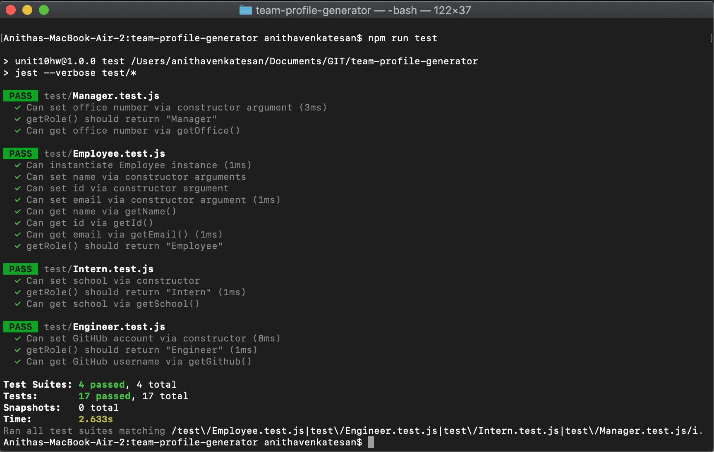
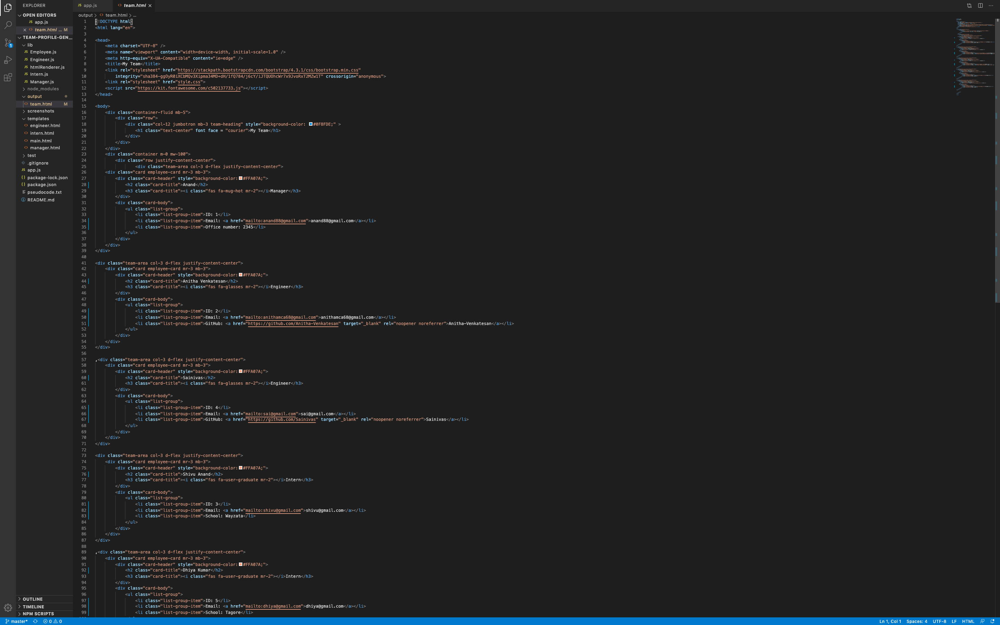
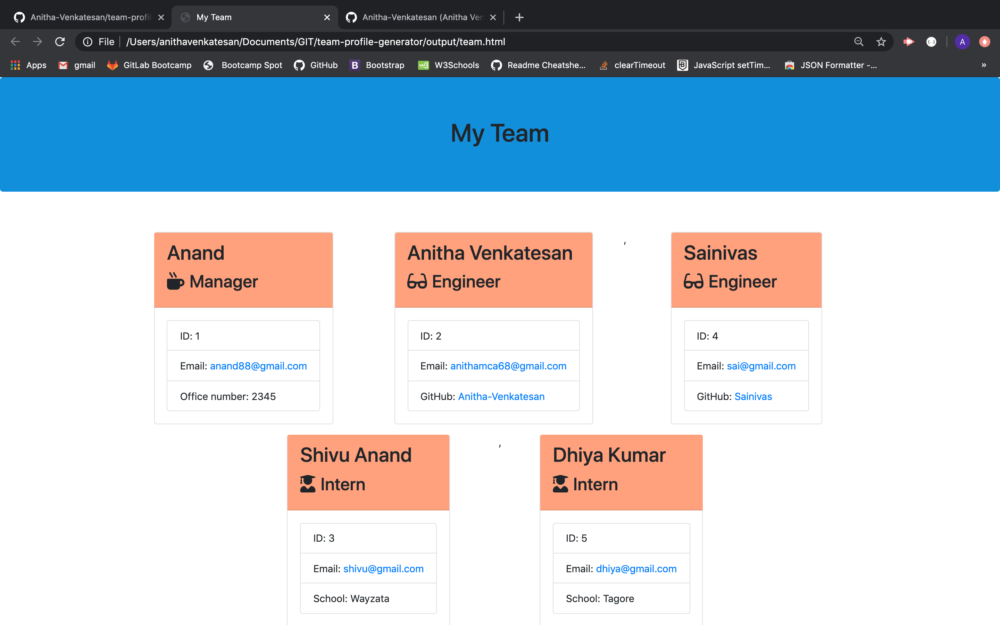

# team-profile-generator
### Description
* A command line application that dynamically generates a html page for a software engineering team.
* The application will prompt the user for information about the team manager and then information about the team members.
* Team members should be a mix of engineer and intern.
* Use the Inquirer npm package to prompt the user for their email, id, and specific information based on their role with the     company. For instance, an intern may provide their school, whereas an engineer may provide their GitHub username.
* Used Jest, a JavaScript Testing Framework for running the tests.

### Installation
Steps to install the node npm packages
* `npm i`

### Dependencies
* lodash
* inquirer
* Note: They already included in npm package.json

### Usage
* `git clone git@github.com:Anitha-Venkatesan/team-profile-generator.git`
* `cd team-profile-generator`
* Open app.js in Command Line Terminal using the command `node app.js`

### Tests
Command used to run the test 
* `npm run test`

### Screenshots
 
 
 
 
 
### Updated Portfolio
https://anitha-venkatesan.github.io/anitha-portfolio/

### References
* https://lodash.com/docs/4.17.15#includes
* https://developer.mozilla.org/en-US/docs/Web/JavaScript/Reference/Global_Objects/isNaN
* https://javascript.info/async-await
